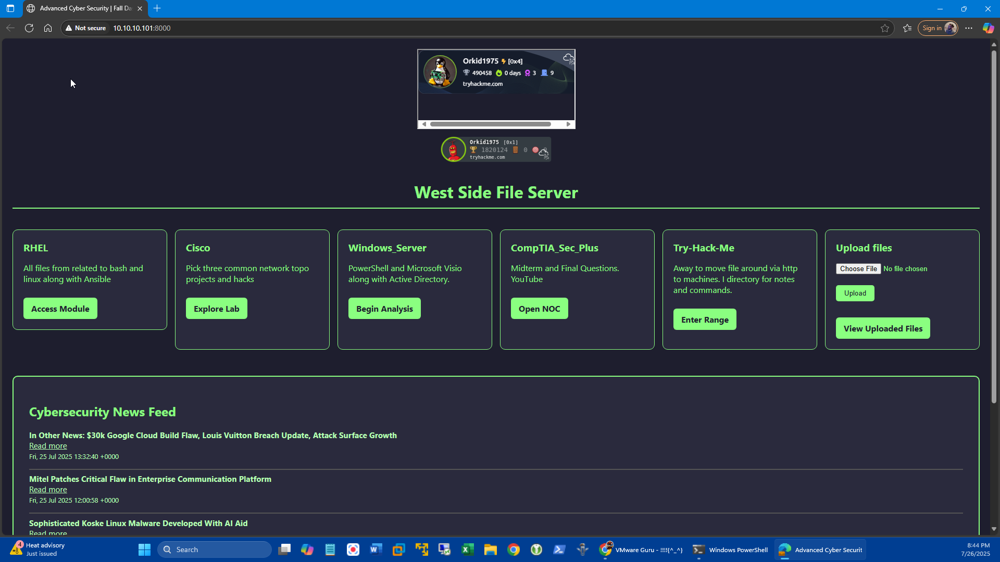

# Cyber Range Project a.k.a Training Environment West

**Figure: Cyber Range - West Side File Server Dashboard | VLAN10**

This screenshot displays the custom HTML dashboard used in the HTTP file server project. Key components include:
- Modular panels for RHEL, Cisco, Windows Server, CompTIA Security+, and TryHackMe.
- A file upload form for transmitting files over HTTP.
- Embedded TryHackMe badge and stats.
- A dynamic cybersecurity RSS news feed with updates pulled from SecurityWeek.

The dark-themed interface with neon-green accents enhances visual clarity while reinforcing a cybersecurity-centric design.

---

**Author**: JAS Digital Tools | Class of 2025 | `jas.digital.tools`
