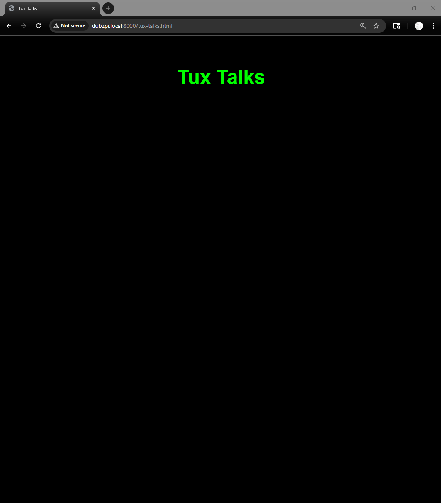

# 🌐 West Side – Cyber Range Entry Point

Welcome to the **West Side** of the Cyber-Range.  
This is your starting position — the way forward is hidden in the files and systems you can explore.  

---

## 🖼️ Orientation

You arrive at the edge of the Cyber-Range, on the **West Side**.  
Strange symbols and clues are scattered here.  

---

## 🐧 The Guardian

Tux, the guardian of this side, will give you cryptic hints — if you can unlock his speech.  

---

---

## 🐧 The Guardian

Tux, the guardian of this side, will give you cryptic hints — if you can unlock his speech.  

---

## 🎯 Objective

- Explore the environment.  
- Read the files.  
- Follow the hidden trail to proceed deeper into the range.  

---

⚡ **Next Step:**  
Check out the files in this directory.  
Remember: `ls -la` is your friend.  

