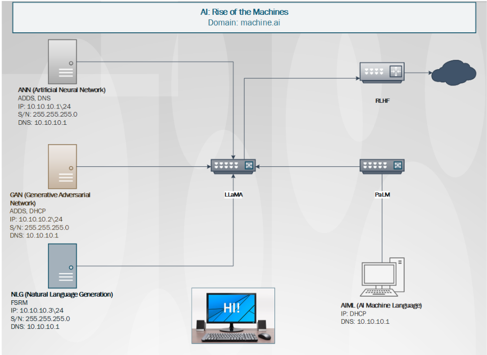

# 🌐 machine.ai Domain (West-Side VLANs)

This folder will contain build documentation, diagrams, and configuration scripts
for the **machine.ai** domain in the Cyber Range portfolio.

---

## 📋 Current Plan
- **Domain Services:** AD DS, DNS, DHCP
- **File Server Role:** FSRM for department shares
- **Test Clients:** Windows 10/11 workstations via DHCP
- **Network:** 10.10.10.0/24 (lab VLAN west-side)

---

## 🚧 Status
🚀 Work in progress. Placeholder until the final domain build is deployed.  
Configuration steps, export files, and screenshots will be added here after
deployment is tested in the Cyber Range.

---

## 📂 Linked Files
- `cyber-awareness.md` → Awareness notes for range usage
- `recap-file` → Running recap of domain setup progress
- `images/` → Diagrams and screenshots

### Images

